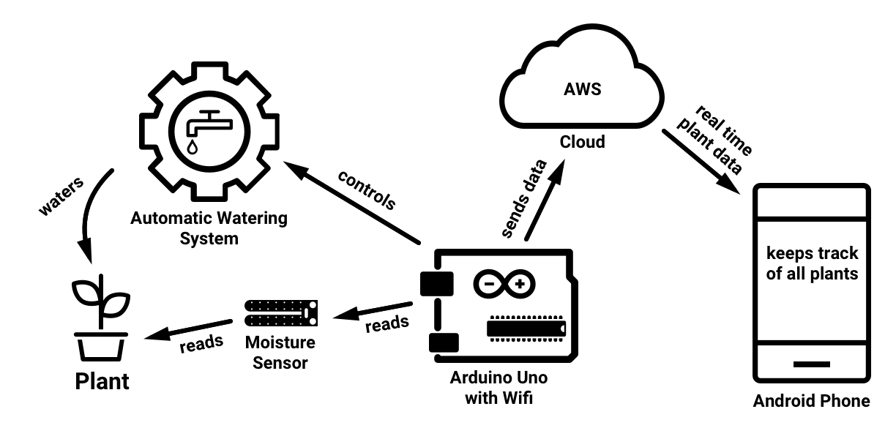
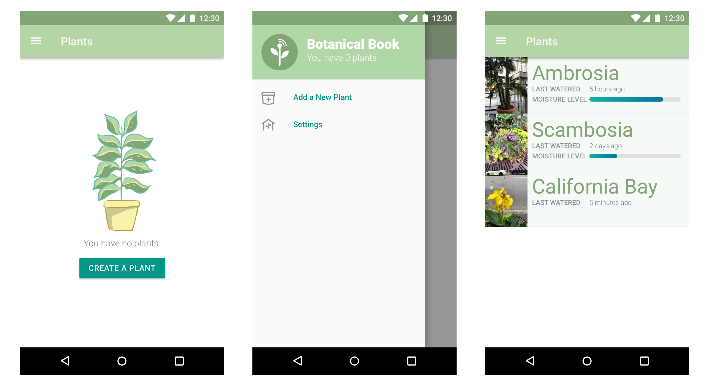
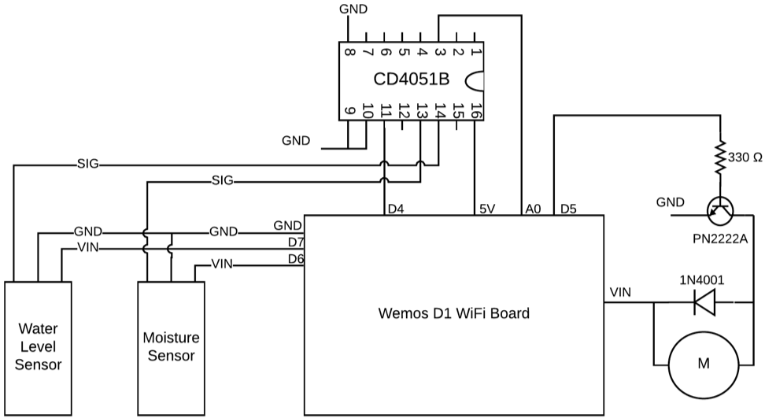
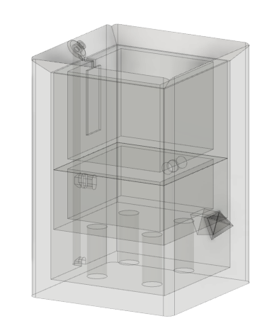

# SmartPot – IoT Solution for Automatically Watering Your Plants 🌱

Taking care of plants can be a challenging task due to busy life schedules. The majority of plants require water and sunlight to be able to survive. SmartPot aims to solve issues with owners neglecting their beloved plants. The project is composed of two main parts: a smart pot named SmartPot which will automatically water a plant when moisture levels are low, and an android application named Botanical Journal which receives real time information from the pot for the plants contained within. The hardware aspect of the project involves using a moisture sensor connected to an Arduino microcontroller to automatically water the plant and communicate with the application through the cloud. On the software side, the android application is used to keep track of plants and display the real-time plant data.

## Built With

The system is separated into hardware and software. The hardware is the device itself with Arduino and motors and the software is Android mobile application.

### Botanical Journal Android Application

The android application uses the MVC design pattern for its architecture. The activities/fragments represent the view; it consists of presentational logic only. Moreover, the application makes use of custom modules (controllers) which will communicate with the data model. The main model of the application will store plant data in an SQLite database which includes plant name, type, birthday, moisture data, water level data, last watering time, image path and notes.

### Hardware

The hardware portion of the project requires making a smart self-watering pot. The main hardware components required for a functional pot are: a moisture sensor, a water level sensor, an Arduino (with Wi-Fi) and a water pump. The components communicate in order to provide a seamless plant watering experience to the user.

The circuit schematic and CAD design of the device are:

# Backend
The back-end is a collection of AWS lambda functions written in NodeJS. The lambda functions connect to DynamoDB to store the state of the pot since the pot and mobile app communicate over the internet.